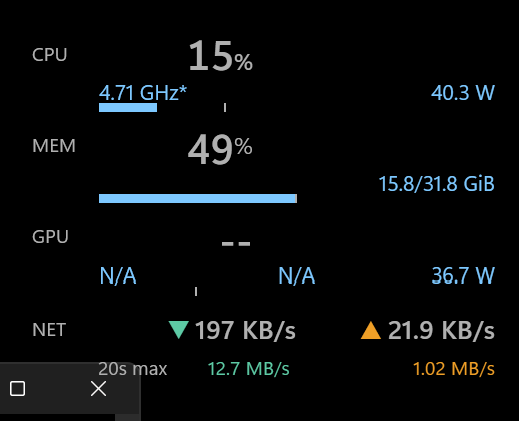
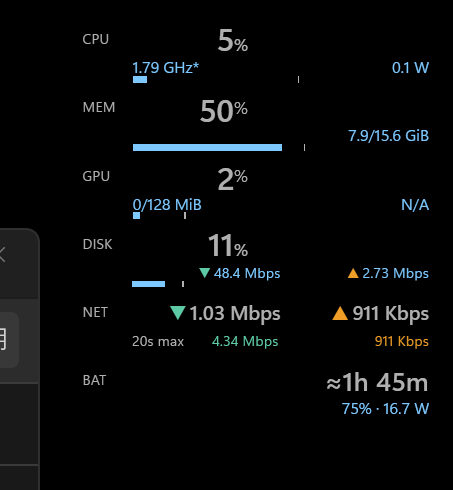

<h1 align="center">Desktop System Monitor</h1>

<p align="center">
  Windows 11の主要なシステム指標を、作業を妨げない小型オーバーレイで表示します。<br>
  <em>A compact Windows 11 overlay that keeps essential system activity visible without getting in the way.</em>
</p>

<p align="center">
  <strong>Source-only experimental preview / ソースのみの評価版</strong>
</p>

<p align="center">
  <a href="#日本語">日本語</a> ·
  <a href="#english">English</a> ·
  <a href="docs/usage/README.md">使い方</a> ·
  <a href="LICENSE">License</a> ·
  <a href="PRIVACY.md">Privacy</a> ·
  <a href="SUPPORT.md">Support</a> ·
  <a href="SECURITY.md">Security</a>
</p>

## 画面例 / UI preview

<table>
  <tr>
    <td align="center">
      
    </td>
    <td align="center">
      
    </td>
  </tr>
  <tr>
    <td align="center">
      <strong>コンパクト表示 / Compact view</strong><br>
      CPU・メモリ・GPU・ネットワークを常時確認
    </td>
    <td align="center">
      <strong>拡張表示 / Expanded view</strong><br>
      ディスク・バッテリーなどを必要な場合だけ追加
    </td>
  </tr>
</table>

> 実際のWindows 11上の表示例です。値は動作イメージであり、精度検証の証拠ではありません。利用できないセンサーは`N/A`になります。
>
> Actual Windows 11 UI examples. Values illustrate the interface and are not evidence of metric accuracy. Unavailable sensors display `N/A`.

## ひと目で分かる機能 / At a glance

| 項目 / Area | 内容 / What it does |
| --- | --- |
| 標準表示 / Default metrics | CPU、メモリ、GPU、ネットワークをコンパクトに表示 / Compact CPU, memory, GPU, and network display |
| オプション / Optional metrics | ディスク、温度、バッテリー、ピーク、高負荷プロセスを必要な場合だけ追加 / Add disk, temperature, battery, peak, and high-load process views only when needed |
| 操作性 / Interaction | クリック透過、常に手前、デスクトップ表示、全画面時の自動非表示 / Click-through, always-on-top, desktop placement, and full-screen auto-hide |
| データ / Data handling | 設定とopt-in診断ログはローカル保存。未対応値は推測せず`N/A`表示 / Settings and opt-in diagnostics stay local; unsupported values show `N/A` instead of estimates |

## 日本語

### 概要

Windows 11 用の小型デスクトップウィジェット。CPU / メモリ / GPU / ネットワークの主要指標を既定表示し、必要な場合だけディスク、温度、バッテリー、直近ピーク、高負荷プロセス詳細を追加できる。

[英語版の詳細](README.en.md) | [使い方](docs/usage/README.md) | [ライセンス](LICENSE) | [プライバシー](PRIVACY.md) | [サポート](SUPPORT.md) | [セキュリティ](SECURITY.md)

> **Experimental:** `DSM-1` のタスク マネージャー比較とADR確定が終わるまでは評価版である。数値精度を前提にせず、Windowsログオン時の自動起動はDSM-1完了後に有効化する。

> **Source-only preview:** この版では公式のprebuilt EXE、portable ZIP、
> 署名済みbinaryを配布しない。利用者がsourceからローカルbuildする評価版であり、
> 指標精度、24時間安定性、個別環境での動作、応答期限付きsupportを保証しない。

## English

### Overview

Desktop System Monitor is an experimental Windows 11 overlay that keeps CPU,
memory, GPU, and network activity visible without taking mouse input. Optional
disk, temperature, battery, peak, and process views are enabled only when the
user chooses them.

[Full English README](README.en.md) | [Usage (Japanese)](docs/usage/README.md) | [License](LICENSE) | [Privacy](PRIVACY.md) | [Support](SUPPORT.md) | [Security](SECURITY.md)

> **Experimental:** This is an evaluation build until the `DSM-1` comparison
> against Task Manager and the related ADR are complete. Do not rely on metric
> accuracy, and do not enable automatic startup before `DSM-1` is complete.

> **Source-only preview:** No official prebuilt EXE, portable ZIP, or signed
> binary is distributed. Users build the source locally; metric accuracy,
> 24-hour stability, operation on individual hardware, and response-time
> support are not guaranteed.

### Quick build

Windows 11, PowerShell 7, and the .NET SDK selected by `global.json` are
required. These commands create local, unsigned builds:

```powershell
dotnet build .\src\DesktopSystemMonitor.App\DesktopSystemMonitor.App.csproj -c Release
pwsh .\scripts\publish-desktop-system-monitor.ps1 -Runtime win-x64
# For Windows on ARM:
pwsh .\scripts\publish-desktop-system-monitor.ps1 -Runtime win-arm64
```

See the [full English README](README.en.md) for highlights, tests, and release
details. The detailed Japanese documentation continues below.

## 実装状況

MVP のコード・自動テスト・portable publish 基盤を実装済み。以下が動作する:

- 幅 280 DIP のコンパクト表示。CPU/GPU/DISK/BATの表示状態に応じて行間と高さを自動調整（MEM/NETは常時表示）
- 既定は文字・通信方向矢印・CPU/MEM/GPU負荷バーだけを描画する透明オーバーレイ。必要に応じて背景色、不透明度、単色／左・下端を透明にするグラデーションを設定可能
- 常に手前モードでは背景だけをデスクトップ層へ分離でき、通常ウィンドウと重なる部分の背景を隠しながら情報表示を手前に維持
- 新規環境では「常に手前」+ クリック透過を既定とし、背後のウィンドウを表示・操作可能
- CPU 利用率 (`% Processor Utility`) と推定周波数 (`% Processor Performance × MaxMhz`)
- CPU消費電力（Windows `Energy Meter` のIntel RAPL packageを優先し、packageがない場合は厳密に一致する`CPU_CLUSTER_<index>`を合算）とGPU package/board消費電力（`LibreHardwareMonitorLib`、取得不能時は`N/A`）
- 物理メモリ使用率と使用量 / 総量 (`GlobalMemoryStatusEx`)
- GPU Engine の busiest-engine 集計、`GPU Adapter Memory\Dedicated Usage` と DXGI `DedicatedVideoMemory` の LUID 対応
- ネットワークの `GetIfTable2` 経由 rx/tx 速度計算（reset/wrap ハンドリング付き）
- 選択した物理ディスク1台の稼働率・read/write速度、CPU/GPU別の温度、バッテリー残量・充放電電力・目標までの推定時間、CPU/MEM/GPU/DISKのピークマーカー、NETのrx/tx MAX表示。NETのMAX期間は10～60秒で設定可能
- トレイから開く閲覧専用の高負荷プロセス画面（CPU、private working set、全I/O accountingのread/write。画面を閉じている間は収集しない）
- クリック透過、`HWND_BOTTOM`/`HWND_TOPMOST` 切替、再入しない `WM_WINDOWPOSCHANGING` 補正。常に手前ではWPF `Topmost` とWin32 `WS_EX_TOPMOST` を同期し、解除を検知した場合だけ最大2秒周期で修復
- タスクトレイからの操作（設定 / クリック透過 / 表示階層 / 自動起動 / 終了）
- 全体・表示位置・外観・CPU・GPU・DISK・NET・BAT・プロセスの左カテゴリ式設定画面
- full-screen 自動非表示、session lock 中のsampling停止、復帰時baseline再初期化
- `WM_DISPLAYCHANGE` / `SPI_SETWORKAREA` 後の遅延再配置。画面回転後もウィジェットを作業領域内へ戻し、同一セッションでは利用者の相対配置を維持
- `%LOCALAPPDATA%\DesktopSystemMonitor\settings.json` へのアトミック保存、`.bak` 復旧、未知field保持
- Named mutex とnamed eventによる二重起動防止・既存プロセスの設定画面表示
- opt-in診断ログ（1 MB × 5世代、metric値・process名・counter instance全文は記録しない）
- Phase 0 用 Diagnostics コンソール（`DesktopSystemMonitor.Diagnostics`）

コード以外で未完了の受け入れ試験:

- タスク マネージャーを並置した全負荷パターンのPhase 0比較とADR確定
- 24時間耐久、multi-monitor/DPI、Explorer再起動、Win+Dの手動試験

これらは対象PCを操作しながらの観測が必要なため、公開状況は[`readiness summary`](docs/validation/readiness-summary.json)で追跡する。温度はbest-effortで取得し、電圧は表示しない。

## 動作要件

必要環境はWindows 11、PowerShell 7（`pwsh.exe`）、および[`global.json`](global.json)に対応する.NET 10 SDKである。初回のrestore/build/publishではNuGet packageと対象RIDのruntime packを取得するため、インターネット接続が必要になる場合がある。生成アプリ自体はself-containedであり、実行先に.NET runtimeを別途導入する必要はない。

## ローカルビルド

このsource-only previewには公式binaryがない。次のコマンドは、利用者の
PC上でsourceをbuildまたはpublishするものであり、署名済み配布物を
downloadする手順ではない。DSM-1完了前はログオン自動起動を推奨しない。

以下は、このREADMEがある`desktop-system-monitor`ディレクトリをカレントディレクトリとして実行する。

```powershell
dotnet build .\src\DesktopSystemMonitor.App\DesktopSystemMonitor.App.csproj -c Release
dotnet run --project .\src\DesktopSystemMonitor.App\DesktopSystemMonitor.App.csproj -c Release

# architecture別self-contained portable版をプロジェクト内distへ生成
pwsh .\scripts\publish-desktop-system-monitor.ps1 -Runtime win-arm64
pwsh .\scripts\publish-desktop-system-monitor.ps1 -Runtime win-x64
```

### ARM64 / x64 ワンタッチ更新

このREADMEと同じディレクトリにある次のバッチをダブルクリックすると、Windowsのフォルダー選択画面が開く。保存先の親フォルダーを選択すると、対象architectureについてReleaseのclean、build、self-contained publish、生成EXEのPE architecture検証まで実行する。初期選択のproject rootをそのまま決定すると、従来どおりproject rootの`dist`へ生成する。project root以外を選択すると、その直下にアプリ固有の`DesktopSystemMonitorBuilds`を作成する。したがって`C:\`を選択した場合の管理対象は`C:\DesktopSystemMonitorBuilds\`となる。選択をキャンセルした場合は何も生成しない。これは現在手元にあるsource treeを再ビルドする機能であり、Git pullや最新版のダウンロードは行わない。更新対象の出力から起動しているDesktop System Monitorは、実行前にタスクトレイから終了すること。対象版が起動中の場合、バッチはファイルを上書きせずエラー終了する。

- `rebuild-desktop-system-monitor-arm64.bat`: カスタム保存先では`<指定した親フォルダー>/DesktopSystemMonitorBuilds/desktop-system-monitor-win-arm64/`へARM64版を生成
- `rebuild-desktop-system-monitor-x64.bat`: カスタム保存先では`<指定した親フォルダー>/DesktopSystemMonitorBuilds/desktop-system-monitor-win-x64/`へx64版を生成

たとえば親フォルダーに`D:\Builds`を指定すると、`D:\Builds\DesktopSystemMonitorBuilds\desktop-system-monitor-win-<architecture>\`へ生成する。フォルダーをバッチへドラッグ＆ドロップするか、コマンドラインの第1引数として渡すこともできる。PowerShellから直接実行する場合は、`pwsh .\scripts\rebuild-desktop-system-monitor.ps1 -Runtime win-x64 -OutputRoot 'D:\Builds'`のように指定する。相対pathはproject root基準で解決する。明示したpathがproject rootと同じ場合だけ、project rootの`dist`を使用する。

更新は管理対象フォルダー（project rootでは`dist`、カスタム保存先では`DesktopSystemMonitorBuilds`）内にある一時ディレクトリへのpublish完了後に最終出力と入れ替える。既存出力は同じ管理対象フォルダーの`_backup-desktop-system-monitor-<runtime>/`へ直前1世代だけ残すため、問題時はアプリを終了し、現在の出力を退避してbackupディレクトリを元の名前へ戻せる。スクリプトが置換・削除するのはarchitecture別出力、一時ディレクトリ、直前1世代のbackupだけであり、指定した親フォルダーや管理対象フォルダー全体は削除しない。ARM64／x64を問わず、同じsource treeの更新を同時起動した場合、後から起動した処理は中断する。

生成物はsingle-fileではないため、`DesktopSystemMonitor.exe`だけを移動せず、`desktop-system-monitor-win-<architecture>`フォルダー全体を保持すること。生成先を変更した後は、ログオン自動起動とshortcutが古いEXEの絶対pathを参照していないか確認し、必要なら新しいpathへ設定し直す。drive rootは親フォルダーとして指定できるが、`DesktopSystemMonitorBuilds`自体を選択すると同名フォルダーの二重作成を避けるためエラーになる。`Program Files`など書き込みに管理者権限が必要な場所や、network drive、同期対象フォルダーでは、権限不足、通信断、同期処理、ウイルス対策ソフトによるlockで更新に失敗する場合がある。

旧版を別の場所から起動している場合、新しい指定先へ生成しても旧EXEは自動削除・更新されない。タスクトレイから旧版を終了し、`Get-Process -Name DesktopSystemMonitor -ErrorAction SilentlyContinue`で残存processがないことを確認してから、新しい管理対象フォルダー内の`desktop-system-monitor-win-<architecture>\DesktopSystemMonitor.exe`を起動する。旧・新版は同じsingle-instance mutexを使うため、旧版が動作中だと新しいEXEは既存instanceを通知して終了する。ログオン自動起動やshortcutも新しいEXEのpathへ利用者が更新する。

## 使用方法

初回は透明なコンパクトウィンドウがプライマリモニターの右上・通常ウィンドウより手前に表示され、タスクトレイに白い円のアイコンが常駐する。設定の「表示位置」では、表示モニター、基準となる四隅、水平・垂直余白を指定でき、「現在位置を使用」または「既定の右上へ戻す」も選べる。既定では背景、外枠、区切り線、バーのトラックを描画せず、文字・矢印・負荷バー以外の領域から背後が見える。設定の「外観」では背景色と背景の不透明度を指定でき、塗り方を「左・下端を透明にするグラデーション」にすると画面内側の壁紙との境界を柔らかくできる。従来の情報領域は最大不透明度のまま維持し、その左側と下側へ5～50%の背景専用領域を追加して、その追加領域だけをフェードする。左方向と下方向のフェードは左下で合成するため継ぎ目は生じない。「他のウィンドウと重なる部分では背景だけ隠す」は常に手前モードだけで有効になり、情報ウィンドウをTopmost、背景ウィンドウをBottomMostとして分離する。通常またはデスクトップ上へ切り替えた間は背景と情報を一体表示し、分離の希望値は保持する。クリック透過中は背後のウィンドウを操作できるが、ウィジェットをドラッグする場合はタスクトレイからクリック透過を解除する。ドラッグ後の位置は自動保存される。右クリックメニューから終了・階層切替・自動起動を操作する。

「常に手前」は、正常時に `SetWindowPos(HWND_TOPMOST)` を繰り返さず、`WS_EX_TOPMOST` が外れた場合だけ修復する。設定画面の終了、Explorer再起動、表示構成変更、full-screen自動非表示からの復帰、session unlockでも同じ修復処理を実行する。session lock中はlayer確認用のWin32 APIを呼ばず、unlock後に状態を再確認する。

## テスト

テストはrepository内に含まれる。次の品質ゲートはrepository rootから実行する。

```powershell
# Core (Ubuntu/Windows 両対応)
pwsh scripts/test-desktop-system-monitor.ps1 -Core

# Windows adapters + Integration (windows-latest のみ)
pwsh scripts/test-desktop-system-monitor.ps1 -Windows

# カバレッジ (Core >= 90% / Windows >= 70% を判定)
pwsh scripts/coverage-desktop-system-monitor.ps1
```

## Phase 0 Diagnostics の実行

```powershell
dotnet run --project .\src\DesktopSystemMonitor.Diagnostics -- --seconds 120 --gpu-refresh-seconds 5 --output phase0.csv
```

同じ負荷を `--gpu-refresh-seconds 1` / `2` / `5` / `10` で別々に実行する。CSVにはCPU候補4系列、Power API値、Hyper-V候補、GPU counter数、collector自身のCPU・working set・handle数も出力される。タスク マネージャーを並べて負荷パターン (idle / CPU / GPU 3D / video decode / network transfer) を各 60 秒以上実行し、[`001-metrics.md`](docs/adr/001-metrics.md) に採用カウンター・許容差・GPU 再展開周期を確定する。2026-07-11の3秒smokeでは、CPU・GPU利用率、GPU dedicated usage/limit、network rx/txがすべて実値を返すことまでは確認済みだが、精度比較には使用しない。

## 既知の制限

- CPU「速度」は `PROCESSOR_POWER_INFORMATION.MaxMhz × % Processor Performance` の推定値で、タスク マネージャーとの完全一致は保証しない。表示に `*` を付けている。
- CPU電力はPC全体のコンセント消費電力ではない。Windowsの `Energy Meter(RAPL_*_PKG)\Power` を最優先し、packageカウンターが1件もない場合だけ `CPU_CLUSTER_<非負整数>` と完全一致するPowerカウンターをcluster index単位で合算し、ミリワットからワットへ変換する。cluster合計はSnapdragon機のCPU rail合計として扱い、Intel packageと同じ測定境界とは保証しない。clusterでは一部の0 mWを許容するが全cluster合計0は`N/A`とし、一部カウンターだけ取得できた値は表示しない。対応Energy Meterがない環境ではLibreHardwareMonitorのCPU packageセンサーへフォールバックする。初期化に一時的に失敗した場合は30秒間隔で再接続する。
- GPU電力は機種が公開するpackage/boardセンサー値である。LibreHardwareMonitor 0.9.6の対応GPU種別にQualcomm Adrenoは含まれず、対象Surface ProのEnergy MeterにもGPU単独チャネルがないためAdrenoは`N/A`になる。`SYS - CPU cluster合計`にはメモリ、NPU、ディスプレイ等が混在し得るためGPU値として推定しない。
- 通常利用に管理者権限は不要である。LibreHardwareMonitor 0.9.6は低レベルセンサー用にPawnIOを参照するが、本アプリはドライバーを同梱・自動導入しない。利用できないセンサーは`N/A`へフォールバックし、CPU電力ではWindows `Energy Meter`を優先する。
- 複数GPUではDXGI表示名とセンサー側のGPU名が一致した場合だけ対応付ける。GPUが1台だけならその値を使用し、複数台で対応先が不明な場合は誤表示を避けて`N/A`にする。
- GPU dedicated memory limit は DXGI から取得しており、integrated GPU で 0 を正当に返す環境ではその 0 をそのまま扱う（取得失敗は `N/A`）。
- ネットワークカウンターは `GetIfTable2` の `InOctets` / `OutOctets` 差分で、パケットオーバーヘッドは含まない。プロバイダー請求量とは一致しない。
- 温度はLibreHardwareMonitorが公開するCPU package/coreおよびGPU coreセンサーのbest-effort値である。センサー非対応、対応先が曖昧な複数GPU、ARM64環境では`N/A`になり得る。
- DISKは選択したphysical disk 1台だけを対象とする。read/writeはPDH counter intervalの平均であり、ファイル単位・プロセス単位の値ではない。Windows volumeが単一physical diskへ還元できない場合は推測で別diskへフォールバックせず、設定から明示選択する。取得不能時の行表示は短い`N/A`とし、理由はツールチップと設定画面に示す。
- バッテリー残時間と充電完了時間は、直近約60秒の有効な放電率または充電率が続く仮定による概算で、`≈`を付ける。充電完了時間の推定は残量5%以上で開始し、1～4%では現在値と目標だけを表示する。充電終盤の出力低下、温度、PC負荷、充電器によって変動し、24時間履歴は保存しない。
- 充電目標は「手動設定」→「同じ停止位置を独立した2充電sessionで観測した自動学習値」→「未学習時100%」の順で決める。自動学習はSmart chargingやメーカー設定をAPIから直接取得した値ではない。上限を解除・変更した場合は学習値を失効し、再び2sessionの観測を必要とする。
- Windowsのsystem aggregate batteryを対象とするためUPSや複数batteryを含む場合があり、packごとの停止上限を識別できない。この構成や上限を頻繁に変更する運用では手動目標を推奨する。
- 高負荷プロセス画面のI/Oは`GetProcessIoCounters`による全I/O accountingであり、純粋なdisk I/Oだけを表さない。process名とPIDは画面にのみ表示し診断ログへ記録しないが、画面共有には映り得る。
- 個別プロセスNETは、標準user tokenで`Microsoft-Windows-TCPIP`のreal-time ETW session開始が`Access denied`となることをARM64実機で確認したため未実装である。全I/Oや接続数をNET速度として代用しない。権限設計を変更する場合は[`プロセス別NET取得ADR`](docs/adr/002-process-network-feasibility.md)の再開条件に従う。
- 「デスクトップ上」表示は `HWND_BOTTOM` の再適用で維持している。Explorer 再起動 / Win+D などで最前面へ上がる環境が残る可能性があるため experimental 扱いとする。
- 常に手前モードの full-screen 自動非表示は、Explorer と同じプロセスに属する `Progman` / `WorkerW` をデスクトップとして除外する。Explorer 再起動後は新しい shell HWND を各判定周期で取得し直すが、再起動中に shell HWND を取得できない数秒間の一過性の点滅は保証外とする。
- タスクバーを自動的に隠す設定では、最大化した通常ウィンドウがモニター全体を覆い、full-screen と判定される場合がある。タスクバーを常時表示した環境では、タスクバーを覆わない最大化ウィンドウを full-screen と判定しない。
- 画面回転時の相対配置はメモリ内のplacement intentで維持するため同一プロセス内に限る。縦向きでアプリを終了・再起動してから横向きへ戻した場合は、縦向きで保存された位置を基準に新しい相対配置を作る。過去orientationの位置を設定schemaへ保存して復元する機能はない。

## ライセンス

Desktop System Monitorの第一者コードは[MIT License](LICENSE)で提供する。追加ライブラリにはそれぞれのライセンスが適用されるため、[`THIRD-PARTY-NOTICES.md`](THIRD-PARTY-NOTICES.md)も参照する。

## 設定

`%LOCALAPPDATA%\DesktopSystemMonitor\settings.json`

- `SchemaVersion`: 2
- 保存対象enumへ値を追加する場合は必ず`SchemaVersion`を上げ、migrationと旧版でのfuture-schema read-only動作を同じ変更に含める。versionを据え置いたまま未知enum文字列を追加すると、旧版は破損設定と区別できないため禁止する。
- `SamplingIntervalSeconds`: 0.5〜5.0 の範囲でクランプ
- `UiScalePercent`: 75〜200
- `LayerMode`: `AlwaysOnTop`（新規既定、透明オーバーレイ推奨）/ `OnDesktop` / `Normal`（bottom-most失敗時の安全フォールバック）。保存済みの明示値は維持する
- `ClickThrough`: bool
- `StartWithWindows`: bool
- `NetworkUnitSystem`: `DecimalBytes`（B/s～GB/sの自動切替）/ `DecimalBits`（bps～Gbpsの自動切替）/ `FixedKilobitsPerSecond`（10進Kb/s固定）
- `SelectedNetworkAdapterLuids`: 空なら Up 状態の非 loopback をすべて集計
- `PinnedGpuLuidHex`: 固定表示するGPUのLUID（空ならbusiest GPU）
- `ShowDiskMetrics` / `ShowTemperatures` / `ShowBatteryEstimate` / `EnableHighLoadProcessDetails`: 任意機能。すべて既定`false`
- `BatteryChargeTargetPercent`: `null`は自動、50～100の整数は手動充電目標
- `LearnedBatteryChargeTargetPercent`: 独立した2回の停止観測で確定した50～99の自動学習値
- `BatteryChargeTargetCandidatePercent`: 1回だけ観測した50～99の候補。確定後またはリセット後は`null`
- `SelectedPhysicalDiskNumber`: `null`ならWindows system volumeから単一physical diskを自動解決し、整数ならそのdiskを明示選択
- `ShowCpuMetrics` / `ShowGpuMetrics`: CPU/GPU行を個別表示。既定は両方`true`
- `ShowCpuTemperature` / `ShowGpuTemperature`: CPU/GPU温度のnullable override。`null`は旧`ShowTemperatures`を継承する。新しい設定画面で保存すると明示boolになり、旧版へ戻した間はlegacy ORにより両方同時表示となる
- `ShowRecentPeaks`: CPU/MEM/GPU/DISKの負荷バー上に直近ピークマーカーを表示（既定`false`）
- `ShowNetworkPeaks`: NETのrx/tx MAX値を表示するnullable override。`null`は旧`ShowRecentPeaks`を継承し、新しい設定画面で保存すると明示boolになる
- `NetworkPeakWindowSeconds`: NET rx/tx MAXだけに適用する10～60秒の整数（既定60秒）
- `FontFamilyName` / `ForegroundColor` / `MutedColor` / `AccentColor` / `RxAccentColor` / `TxAccentColor`
- `BackgroundEnabled`: 背景表示。既定`false`
- `BackgroundColor`: 背景RGB。旧ARGB値のalphaは`BackgroundOpacity`が未設定の場合だけ移行値として使用する
- `BackgroundOpacity`: nullableの背景不透明度（0～1）。設定画面で保存すると明示値になる
- `BackgroundFillMode`: `Solid`（単色、既定）または`EdgeFade`（左辺・下辺を透明化）
- `BackgroundEdgeFadePercent`: `EdgeFade`で情報領域の左側へ追加する幅と下側へ追加する高さ（情報領域寸法の5～50%、既定22%）
- `HideBackgroundBehindWindows`: `AlwaysOnTop`時だけ背景をBottomMostへ分離する希望値。`Normal` / `OnDesktop`中も保存値は保持する
- `Opacity`: 旧ウィンドウ全体opacityとの互換性のためJSONに保持するが、描画には使用しない
- `AutoHideOnFullScreen`: 常に手前モードのfull-screen自動非表示
- `DiagnosticLoggingEnabled`: `%LOCALAPPDATA%\DesktopSystemMonitor\logs` への制限付きログ。有効時は自動非表示の開始・終了を `fullscreen-auto-hide-enter` / `fullscreen-auto-hide-exit`、sampling停止・再開を `sampling-suspend-enter` / `sampling-suspend-exit` として記録する（ウィンドウ名・クラス名・PIDは記録しない）

診断ログは、タスクトレイの「設定」から「診断ログを有効にする（最大1 MB × 5世代）」を選択して有効化する。layer不一致を検知した場合は `layer-repair-enter`、Win32適用または観測に失敗した場合は `layer-apply-failure`、回復した場合は `layer-repair-recovered` を確認する。記録値は要求layer、観測状態、固定trigger/failure分類、Win32 error、連続失敗数に限定し、HWND、他プロセス名・PID、ウィンドウタイトルは記録しない。

破損時は自動で `.bak` から復旧し、それも失敗した場合は既定値で起動する。

設定画面の「学習値をリセット」は保存を確定した場合だけ学習値と候補を消去し、キャンセル時は変更しない。旧versionは上記の未知fieldを保持するが、旧versionの実行中は自動学習値の更新・失効を行わないため、新versionへ戻るまで保存値は凍結される。

## アンインストール

1. タスクトレイのメニューで自動起動を無効にする。
2. タスクトレイからDesktop System Monitorを終了する。
3. 配置したportableバイナリのディレクトリと、作成したshortcutを削除する。
4. 設定と診断ログも不要な場合だけ、`%LOCALAPPDATA%\DesktopSystemMonitor`を削除する。

portableバイナリを削除しても設定と診断ログは自動削除されない。ローカルデータの内容は[`PRIVACY.md`](PRIVACY.md)を参照する。
